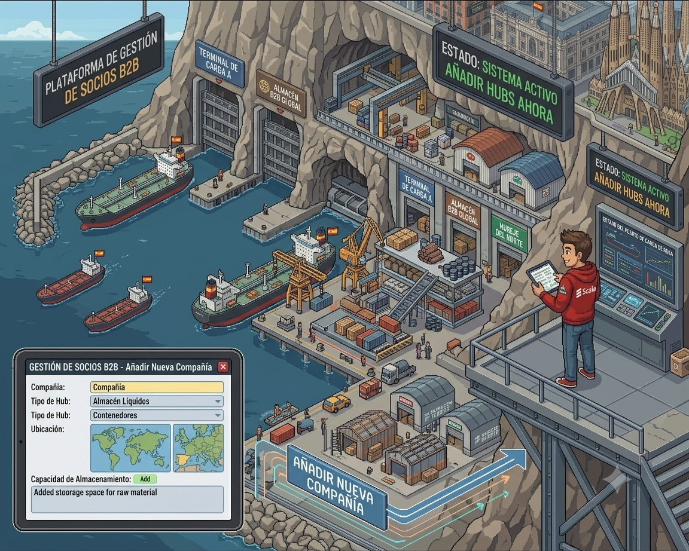
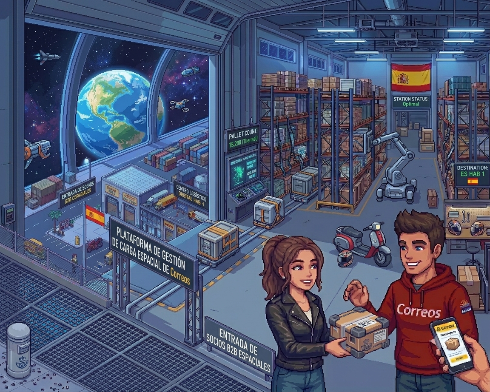

# Project B2B Billing Logistics 🚢🚛📦🇪🇸💶️ Scala 3, Play Framework

A high-performance, fault-tolerant reactive backend engine simulating automated multi-tenant warehouse provisioning, real-time yard management, and automated time-slot billing. The project is highly inspired by the complex supply chain challenges, toll systems, and high-throughput distribution hubs powering the Spanish logistics corridors 🇪🇸.
The project is designed following the core principles of **Domain-Driven Design (DDD)** and **Hexagonal Architecture (Ports & Adapters)** using the modern **Play Framework (Pekko-based)** asynchronous web server and **Scala 3**.

## 🎯 Business Context & Objectives
In modern B2B logistics and yard management platforms, key requirements include strict resource isolation, absolute pallet-balance auditing, and absolute resilience to hardware or network failures. This project simulates an enterprise warehouse core ledger, handling highly concurrent check-in/check-out events and automated billing requests across thousands of virtual storage zones per second without operating system thread blocking (Lock-free / Non-blocking asynchronous processing).

<p align="left">
  
  
</p>

--- 

## 📐 Architecture & System Design

The project is strictly separated into three layers according to Hexagonal Architecture, isolating logistics and billing business logic from external frameworks:

1. **Domain (Pure Domain):** Encapsulates warehouse infrastructure business rules, core entities (Hubs, Docks, Storage Zones), and Value Objects. It has zero dependencies on Play Framework, Pekko, or databases, written in pure Scala 3.
2. **Application (Application Layer):** The orchestration layer where the Pekko Actor System and Background Schedulers manage the asynchronous lifecycle of warehouse processes, tracking split-batch cargo flows, and automating hourly billing tasks.
3. **Infrastructure (Infrastructure Layer):** The system's external interfaces and adapters, including a REST API powered by Play Framework (Pekko-based), relational data persistence via PostgreSQL (with Slick/Anorm), and real-time state caching utilizing Redis.

---

### Components & Model Design:
*   **`DockTrackerActor` (Aggregate Root):** Represents a physical loading gate (Dock). Ensures thread-safe, sequential processing of vehicle arrivals, departures, and time-slot allocations from its `Mailbox`, eliminating race conditions during peak hours.
*   **`BillingOrchestratorActor` (Process Manager / Background Daemon):** A resilient background engine driven by the Pekko Scheduler. It automates hourly multi-tenant billing loops, aggregates active cargo metrics, and guarantees strict invoice computation without blocking web threads.
*   **`CapacityMonitorActor` (Storage Validation System):** Asynchronously analyzes the influx of pallet movements against available storage zone quotas, serving as a non-blocking gatekeeper to prevent warehouse overflow.
*   **`NotificationDispatcherActor` (Alert Service):** An isolated notification delivery actor with a configured *Supervision Strategy* to handle external network drops or AWS SDK connection timeouts during report dispatches.
*   **`RedisCacheSyncActor` (State Materializer):** Manages real-time state synchronization, instantly pushing active dock states and current warehouse occupancy metrics into Redis for ultra-fast, lock-free query responses.

---

## 🧠 Applied Algorithms (Computer Science)
*   **Token Bucket / Leaky Bucket Rate Limiter:** Monitors incoming B2B API call frequency from warehouse IoT sensors in real-time inside the `CapacityMonitorActor` to prevent system denial-of-service and handle burst traffic.
*   **Interval Tree / Range Overlap Algorithm:** Validates time-slot bookings at the domain service level to prevent dock booking collisions, ensuring no two trucks are scheduled to occupy the same physical gate simultaneously.

<p align="left">
  
  
</p>

## 📁 Project Directory Structure (DDD)

```text
src/main/scala/com/techmatrix18/
├── Main.scala                    # Application Entry Point (initializes Play Framework server)
├── conf/                         # Play Framework configuration files (application.conf, logback.xml)
│   └── routes                    # Play Framework HTTP route definitions
├── hubs/                         # HUB & WAREHOUSE INVENTORY MODULE (Multi-tenant structure & Cargo Balances)
│   ├── domain/                   # Pure entities (Hub, StorageZone, CargoBalance) & repository traits (Ports)
│   ├── application/              # Use Cases (ProvisionHub, CheckInCargo) & CapacityMonitorActor
│   └── infrastructure/           # Play controllers (HubRouter), MySQL mappings (Slick/Anorm), & Redis Sync
├── gates/                        # YARD & GATE MANAGEMENT MODULE (Loading gates & time-slot bookings)
│   ├── domain/                   # Entities (Gate, GateBooking) & core traffic rules
│   ├── application/              # Use Cases (BookSlot, ArriveAtGate) & GateTrackerActor
│   └── infrastructure/           # IoT/HTTP controllers for gates, Redis state management
└── billing_transactions/         # AUTOMATED BILLING & FINANCIAL ENGINE MODULE
    ├── domain/                   # Core invoice entities, billing transaction records, & math formulas
    ├── application/              # BillingOrchestratorActor & Pekko Schedulers for hourly calculations
    └── infrastructure/           # Ledger storage adapters (MySQL) & automated AWS S3 cold log archiver
```

---

## 🛠️ Technology Stack
*   **Programming Language:** Scala 3.3.4 (Strict compilation presets: `-Xfatal-warnings`, `-deprecation`)
*   **Web Framework:** Play Framework 3.0.6 (Modern Pekko-based asynchronous MVC architecture)
*   **Actor System:** Apache Pekko Actor Typed 1.1.2 (Integrated via Play for background task orchestration)
*   **I/O & HTTP Interface:** Apache Pekko HTTP 1.1.0 & Play JSON (Type-safe automated B2B payload serialization)
*   **Build Tool:** sbt 1.10.1
*   **Logging:** Play Logger & Logback Classic 1.5.6 (Integrated via SLF4J)
*   **Testing Framework:** ScalaTest 3.2.19 & Play TestKit (Support for automated route and integration testing)

--- 

## 🚀 Quick Start with Docker (Local Stack Deployment)

The entire environment (PostgreSQL database + compilation and execution of the Scala application) is spun up with a single command.

### 1. Start the Platform
Run the following command in the root directory of the project:
```bash 
docker-compose up --build -d
```

During the initial startup, Docker will automatically:
* Download the PostgreSQL 15 image and initialize the database using the `init.sql` script.
* Trigger a Multi-stage build for the Scala application, execute `sbt dist`, and deploy a lightweight JRE runtime image.
* Bootstrap the database schema and expose the REST API on port `9000`.

### 2. Verify Container Status and Logs
Ensure that all services are up and running correctly:
```bash
# Check the status of running containers
docker-compose ps

# Stream application logs in real-time
docker-compose logs -f auth_app

# Stop and remove all active containers and networks
docker-compose down
```

---

## 🛠️ Development without Docker (Local sbt)

If you are running the database in Docker but prefer to compile and debug the Scala code directly within your IDE (IntelliJ IDEA):

1. Spin up only the database container:
   ```bash
   docker-compose up postgres_db -d
   ```
2. Run the application locally via sbt:
   ```bash
   sbt run
   ```
   *The `application.conf` configuration will automatically fallback to the default `jdbc:postgresql://localhost:5432/billing_logistics_db`.*

---

## 📂 API Contract Structure

### 🔑 1. Authentication (Login)
* **Endpoint**: `POST /api/v1/auth/login`
* **Required Header**: `X-Idempotency-Key: <UUID>`
* **Request Body (JSON)**:
  ```json
  {
    "usernameOrEmail": "driver_john",
    "passwordRaw": "secure_password"
  }
  ```

### 🔄 2. Token Rotation (Refresh)
* **Endpoint**: `POST /api/v1/auth/refresh`
* **Required Header**: `X-Idempotency-Key: <UUID>`
* **Request Body (JSON)**:
  ```json
  {
    "refreshToken": "4a7b9e02..."
  }
  ```

and for example:

### 💸 3. Billing Transaction / Payment 
* **Endpoint**: `GET /api/v1/billing-transactions`
* **Required Header**:
    * `X-Idempotency-Key: <UUID>` *(Guarantees that the money will not be deducted twice in case of network retries)*
    * `Authorization: Bearer <access_token>`
* **Request Body (JSON)**:
  ```json
  {
    "accountId": 10582,
    "amount": 250.00,
    "currency": "USD",
    "paymentMethod": "CREDIT_CARD"
  }
  ```

